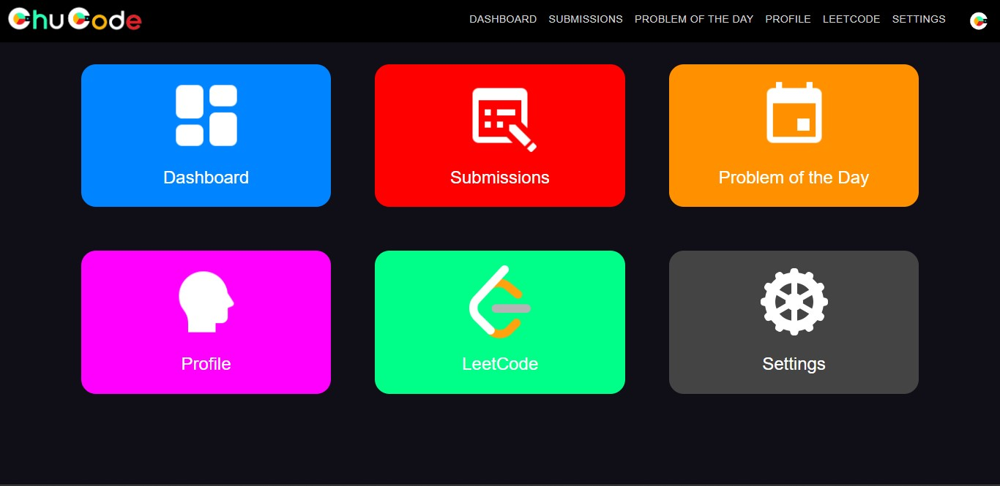
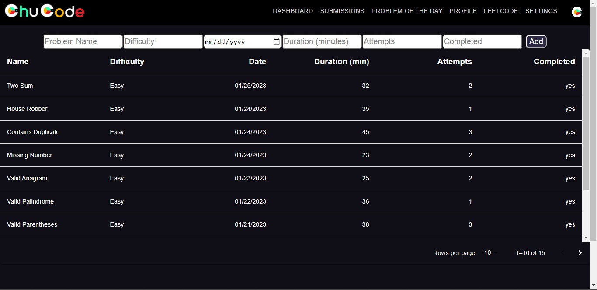

# ChuCode
Modern Web Application  
MongoDB, Express.js, React.js, Node.js, CSS   

## Introduction
ChuCode is a modern web application that simplifies the technical interview preparation process. It analyzes your data from LeetCode and generates personally designed feedback on how you should progress on your preparation. ChuCode will guide you in the right direction by providing insights on you strengths, weaknesses, and what kinds of problems you need to solve more of to be fully prepared. The app will let you know your progress to being ready and let you know when you are fully prepared to tackle those technical interviews. All you have to do is input your LeetCode submissions every time you solve a problem and let ChuCode do the rest.

## Description
### Features
* Dashboard that displays all your personal insights, analytics, and suggestions for your technical interview preparation journey
* Submissions log where you can view all of your problem submissions and statistics
* LeetCode link so you can jump right in to problem solving after viewing your guide
* LeetCode Problem of the Day 

 

